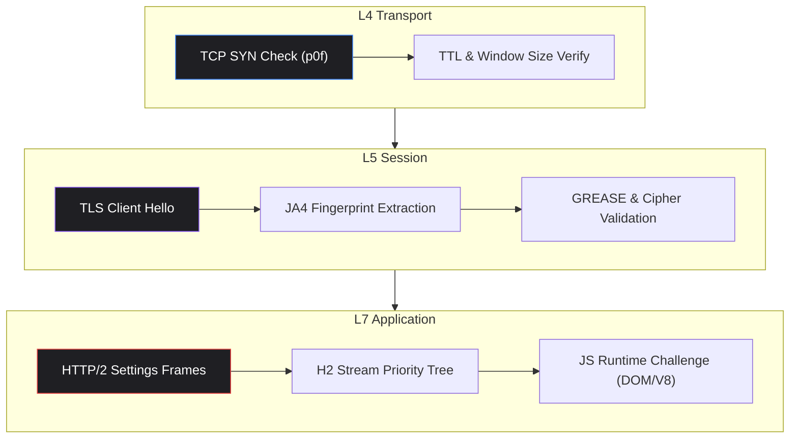
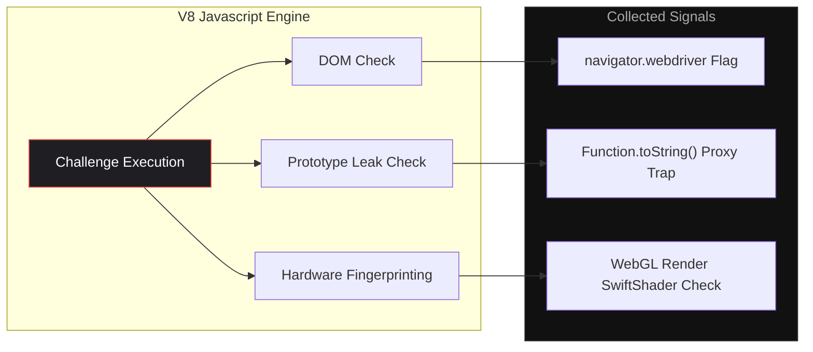
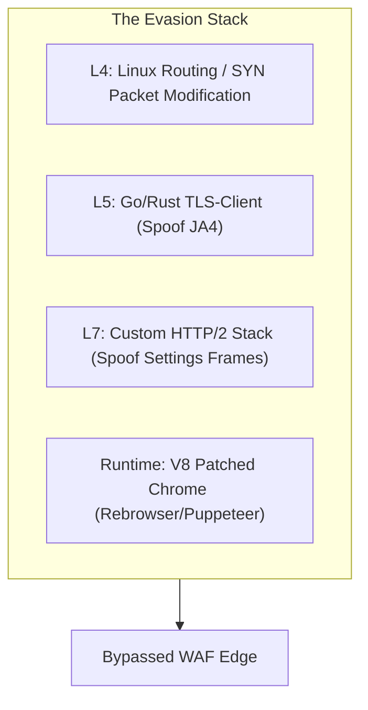

# Introduction

If you look at the raw request logs of any major web platform today, you'll see a quiet, ongoing war. According to recent telemetry from bad-bot research, automated bot traffic consistently accounts for **over 50% of all internet activity**. The web is now a machine-majority landscape.

To defend their infrastructure, prevent ad revenue fraud, stop credential stuffing, and protect free API tiers, platforms implement complex Web Application Firewall (WAF) services and anti-bot systems like **Cloudflare Turnstile, Akamai Bot Manager, hCaptcha, and Datadome**.

In this deep dive, we'll analyze the low-level mechanics of these defense layers, explore how modern automation bypasses them, and explain why bot defense is fundamentally a game of economics rather than pure cryptography.

---

## The Network Stack: Edge Validation Lifecycle

When an incoming connection hits a WAF-protected edge server, the validation process executes sequentially from Layer 4 up to Layer 7 before the application backend ever sees the request.



---

## 1. TCP/IP Fingerprinting (L4 p0f)

Before a single byte of TLS payload is decrypted, the WAF analyzes the TCP connection parameters. This is called **Passive OS Fingerprinting (p0f)**. 

During the initial three-way handshake, the client sends a `SYN` packet. The WAF inspects:
*   **Initial Time to Live (TTL):** Different operating systems initialize packets with specific TTL values (e.g., Linux defaults to `64`, Windows to `128`, iOS/macOS to `64`).
*   **Maximum Segment Size (MSS):** The maximum amount of data in a single TCP segment, often dictated by network hardware and OS routing defaults.
*   **Window Size ($W$):** The initial buffer capacity.
*   **TCP Options & Layout Order:** The order of parameters like Maximum Segment Size (MSS), Window Scale (WS), SACK-Permitted, NOP, and Timestamps (TS).

**The Threat Signature:** If a web scraper modifies its HTTP headers to claim it is running Google Chrome on Windows 11, but the underlying TCP `SYN` packet arrives with a TTL of `64` and Linux-specific TCP options, the WAF flags the connection as a forged client at the kernel layer and drops it.

---

## 2. TLS Fingerprinting (L5 JA3 / JA4)

Once the TCP socket is established, the client initiates the TLS handshake by sending a `Client Hello` packet. This contains the browser's cryptographic options.

### The JA4 Spec Breakdown
JA4 represents a significant upgrade over the legacy JA3 standard by introducing human-readable, deterministic groupings. A JA4 fingerprint is represented by a three-part string structured as **`JA4a_JA4b_JA4c`**:

$$\text{JA4} = \text{JA4a (Protocol/Settings)} \_ \text{JA4b (Ciphers Hash)} \_ \text{JA4c (Extensions/Signature Algorithms Hash)}$$

```
Example JA4 Hash:   t13d1516h2_8daaf6152771_0b6e1b6f0012
```

1.  **`JA4a` (Transport & ALPN):**
    *   `t`: Transport protocol (e.g., `t` for TCP, `q` for QUIC).
    *   `13`: TLS Version offered (e.g., `13` = TLS 1.3).
    *   `d`: SNI (Server Name Indication) status (`d` = SNI present, `e` = absent).
    *   `15`: Count of cipher suites.
    *   `16`: Count of extensions.
    *   `h2`: ALPN protocol (e.g., `h2` = HTTP/2, `h3` = HTTP/3, `11` = HTTP/1.1).
2.  **`JA4b` (Ciphers):**
    *   A SHA-256 hash of the list of cipher suites supported by the client, sorted alphabetically. By sorting the ciphers, JA4 avoids false negatives caused by random cipher reordering.
3.  **`JA4c` (Extensions & Signatures):**
    *   A SHA-256 hash of the TLS extensions and signature algorithms, sorted alphabetically.

### Cryptographic GREASE Detection
To prevent network middleboxes from breaking when new TLS extensions are introduced, Chromium-based browsers use **GREASE (Generate Random Extensions And Sustain Extensibility)**. During the TLS handshake, Chrome injects random, dummy values (such as `0x0a0a` or `0x1a1a`) into the cipher suites, extensions, and supported groups.

Anti-bot filters verify the presence and allocation profile of these GREASE values. Standard HTTP client libraries in Node.js (`axios`) or Python (`requests`) do not emit GREASE values and use fixed, non-browser cryptographic orders. When a request presents a User-Agent claiming Chrome, but lacks GREASE values or lists Go's TLS ciphers, the connection is instantly rejected.

---

## 3. HTTP/2 Fingerprinting (L7 Protocol Heuristics)

If the client negotiates HTTP/2 via ALPN, it sends an HTTP/2 connection preface (`PRI * HTTP/2.0\r\n\r\nSM\r\n\r\n`) followed immediately by a `SETTINGS` frame.

```
Chromium HTTP/2 SETTINGS Frame Profile:
[SETTINGS_HEADER_TABLE_SIZE: 65536]
[SETTINGS_ENABLE_PUSH: 0]
[SETTINGS_MAX_CONCURRENT_STREAMS: 1000]
[SETTINGS_INITIAL_WINDOW_SIZE: 6291456]
[SETTINGS_MAX_FRAME_SIZE: 16384]
[SETTINGS_MAX_HEADER_LIST_SIZE: 262144]
```

Modern anti-bot engines analyze the parameters of this frame:
*   **H2 Settings Order & Values:** Every browser compiles its HTTP/2 engine (e.g., Chromium's `nghttp2`) with highly specific defaults. The exact sequence and values of the settings parameters are parsed.
*   **H2 Stream Prioritization Trees (RFC 7540):** Browsers configure custom dependency trees for resource requests to prioritize CSS and JS assets over background images. Each browser sets different stream weights (e.g., weight `256` for root streams).
*   **`WINDOW_UPDATE` Frames:** The initial size changes of the TCP/HTTP flow window are tracked.

Because standard networking clients (like Go's `net/http` or Node's `http2`) use default settings arrays that differ drastically from Chrome or Safari, the WAF can flag bots without checking headers or running JS.

---

## 4. JS Challenge: DOM Telemetry & V8 Sandboxing

If the network layer looks legitimate, the WAF serves a client-side JavaScript challenge (such as Cloudflare's JS Challenge or Akamai's Sensor script) that executes inside the client's V8 browser engine to gather deep environmental telemetry.



### Advanced DOM Detection Vectors

#### 1. CDP & WebDriver Injections
Headless browsers controlled via Chrome DevTools Protocol (CDP) inject variables into the page runtime. Anti-bot engines search the global environment for these variables:
*   `window.navigator.webdriver` (must be `false` or `undefined`).
*   CDP functions like `window.cdc_adoQy2ioDncZgoDYjhxTcjfq_Array` or `window.cdc_adoQy2ioDncZgoDYjhxTcjfq_Promise`.
*   Properties on `document` or `window` starting with `__webdriver`, `__selenium`, or `$cdc_`.

#### 2. Native Method Prototype Verification
If an automation script attempts to spoof environment variables using `Object.defineProperty` or `Proxy` overrides, the anti-bot script inspects their prototype chains:
*   **Receiver Validation:** Calling `navigator.languages` directly:
    ```javascript
    // Throws a TypeError if called on a plain mocked object
    Navigator.prototype.__lookupGetter__('languages').call(navigator); 
    ```
*   **Function Stringification (`toString`):** Checking if a function has been modified:
    ```javascript
    if (Function.prototype.toString.call(document.createElement) !== "function createElement() { [native code] }") {
        // Native code was intercepted/hooked!
    }
    ```
*   **V8 Call Stack Profiling:** Intentionally throwing a runtime error and parsing the `error.stack` string to look for files originating from NodeJS, Puppeteer, or Playwright environments.

#### 3. Hardware Rendering & VM Checks
*   **Canvas Fingerprinting:** The script draws text and shapes onto a hidden `<canvas>` element. Due to subtle GPU driver optimizations and anti-aliasing variations, the output PNG hash is highly unique to the hardware.
*   **WebGL Renderer Inspection:** The script queries the GPU card parameters:
    ```javascript
    const gl = canvas.getContext('webgl');
    const debugInfo = gl.getExtension('WEBGL_debug_renderer_info');
    const renderer = gl.getParameter(debugInfo.UNMASKED_RENDERER_WEBGL);
    ```
    If `renderer` contains words like `SwiftShader`, `LLVMpipe`, or `VirtualBox`, the WAF knows the client is running on a headless virtual machine.
*   **Font Enumeration:** Measuring the exact pixel width and height of various strings containing different fallback fonts inside a hidden `<iframe>`. This generates a unique profile of the local fonts installed on the client machine.

---

## The Evasion Stack: Bypassing Advanced Heuristics

To bypass these deep inspection layers, modern automation operators deploy advanced, low-level evasion frameworks.



### Low-Level Network Spoofing
Instead of full browsers, high-throughput crawlers compile custom Go or Rust networking binaries (such as Go's `tls-client` or C++ `curl-impersonate`) that run without the overhead of rendering engines. These frameworks:
1.  Intercept the TLS handshake payload assembly, matching the ciphers, extension configurations, and GREASE distribution profiles of Chrome.
2.  Pre-compile exact HTTP/2 frames, settings weights, and priority structures.
3.  Inject matching User-Agent strings.

### V8 Engine Patching (e.g., Rebrowser)
For tasks that require full page evaluation (e.g., executing client-side Single Page Apps), headless browsers must be patched at the V8 debugger level.

Instead of overriding properties like `navigator.webdriver` using JavaScript hooks (which leave prototype trace leaks), developers use tools like **Rebrowser** to:
*   Modify browser parameters at the browser engine compiler stage.
*   Hook the Chrome DevTools Protocol debugger socket to block automated script indicators before the page scripts load.
*   Emulate ES6 proxy objects with recursive trap scopes that mimic standard browser constructor patterns.

---

## Proxies: The IP Reputation Hierarchy

The core of any automation campaign is IP routing. Anti-bot firewalls score requests based on their autonomous system network (ASN) classification.

| Proxy Type | Cost per GB | Target ASN Type | Block Risk | Best Use Case |
| :--- | :--- | :--- | :--- | :--- |
| **Datacenter** | \$0.10 - \$0.50 | Hostings (AWS, DigitalOcean, OVH) | **Very High** | High-speed API queries on basic platforms |
| **Residential** | \$2.00 - \$12.00 | Consumer ISPs (Comcast, Comcast Business, BT) | **Medium** | Standard web scraping and search engines |
| **Mobile LTE** | \$5.00 - \$20.00 | Cellular Carriers (AT&T, Verizon, Vodafone) | **Very Low** | Bypassing strict logins / CGNAT protection |

### The Power of CGNAT Mobile IPs
Mobile LTE proxies represent the most resilient routing mechanism due to **Carrier-Grade NAT (CGNAT)**. Mobile carriers assign a single public IPv4 address to thousands of devices simultaneously. 

If a WAF drops or challenges a request from a mobile IP because it detected a bot connection, it risks blocking thousands of real human clients sharing that same IP. Consequently, WAF engines assign exceptionally low risk scores to cellular ASNs, making them highly effective for evasion campaigns.

---

## Defensive Strategy: Building Resilient Architectures

For systems engineers looking to defend their platforms from scraping campaigns and credential stuffing, a multi-layer strategy is required:

### 1. Intercept at the Edge
Never validate tokens or calculate signatures inside your application framework (Node.js/Django). Serve JS verification challenges and validate TLS signatures directly inside an edge worker (e.g., Cloudflare Workers, AWS CloudFront Functions) to preserve your database and application capacity.

### 2. Implement JA3/JA4 Edge Verification
Validate that the user's TLS profile matches the User-Agent claimed. If a request claims `Chrome/124.0` but the JA4 fingerprint matches a Python library, drop the packet at the edge.

### 3. Deploy DOM Honeypot Anchors
Inject hidden HTML fields or links using CSS attributes like `display: none;` or `opacity: 0; pointer-events: none;`. Real users will never navigate to or click on these elements. If a client attempts to parse the HTML and submits values to these endpoints, flag their IP or session context immediately.

### 4. Require Edge-Validated Session Cookies
Maintain state flags using encrypted, edge-validated cookies (e.g., `_abck`). Validate that the client executes the telemetry script regularly. If a client requests a sensitive data endpoint without an active, validated token cookie, block the request immediately.

---

*This article is written for educational and defensive development purposes. Understanding browser verification layers is key to building resilient, production-grade security architectures.*

## Frequently Asked Questions

### How does JA4 TLS fingerprinting differ from JA3?
JA3 compiles cipher suites and extensions in the exact order they are received into a single comma-delimited string and hashes the result. This makes it fragile and easy to bypass by reordering extensions. JA4 resolves this by sorting ciphers and extensions alphabetically before hashing, and structuring the output into a human-readable prefix (`JA4a`) representing options/counts, followed by sorted cryptographic hashes (`JA4b`, `JA4c`).

### Why are mobile LTE IP addresses (CGNAT) so difficult for WAFs to block?
Carrier-Grade NAT (CGNAT) allows mobile network operators to share a single public IPv4 address among thousands of individual cellular mobile devices. If a WAF blocks a mobile IP, it will block not just the automated crawler, but thousands of legitimate mobile phone users. Consequently, security firewalls must assign low risk scores to mobile carrier ASNs.

### Can headless browsers (Puppeteer, Playwright) ever fully bypass Cloudflare Turnstile or Akamai Bot Manager?
No browser automation framework is fully undetectable. While patched drivers (like Rebrowser or Puppeteer-Stealth) attempt to mask CDP variables and override native method prototype traits, WAFs continually deploy updated scripts looking for V8 debugging protocols, graphics driver virtualization side-channels (like Canvas speed-testing), and mouse curve acceleration dynamics that betray automated execution.