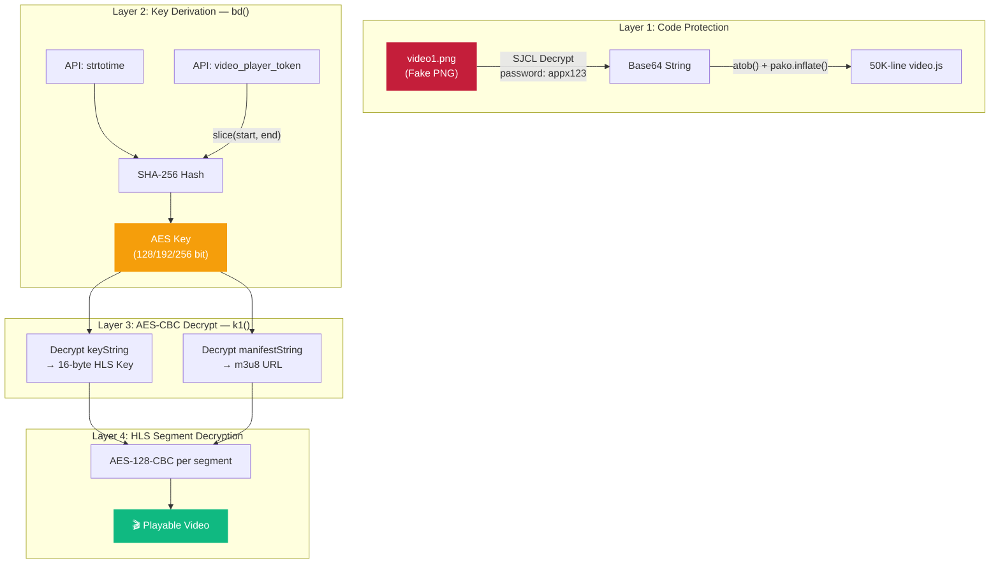
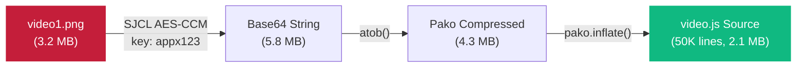
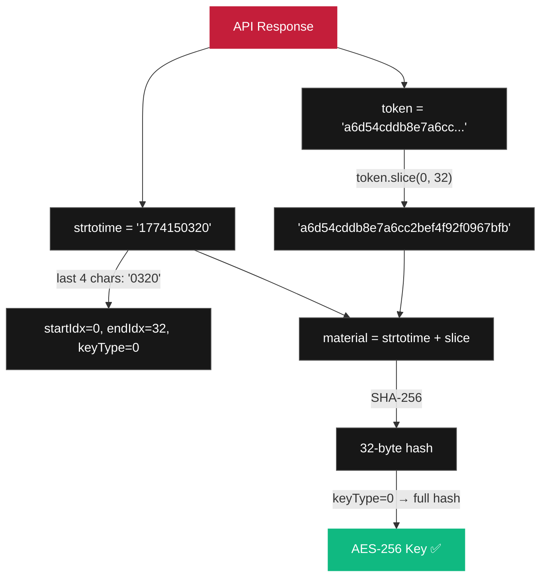
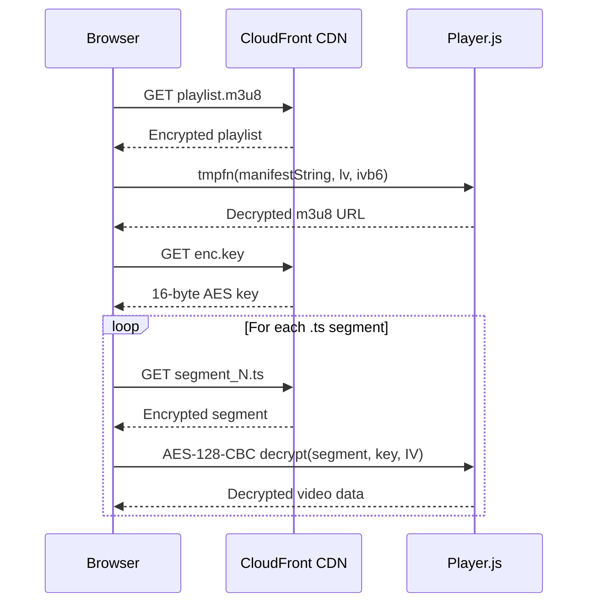
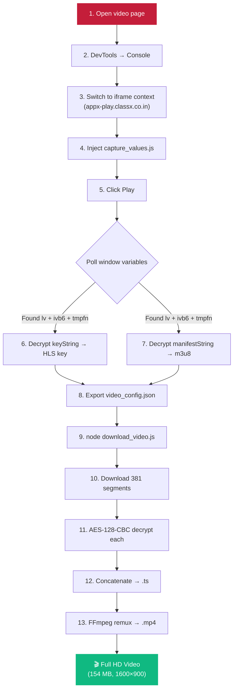
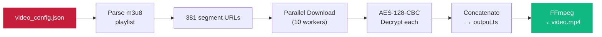
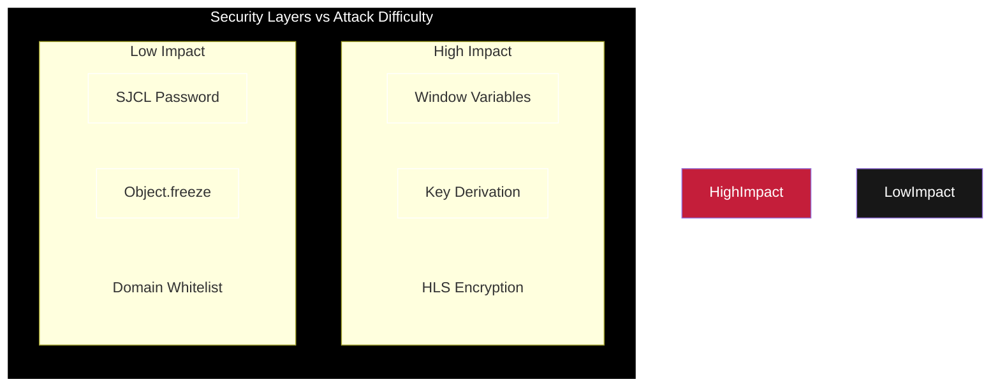
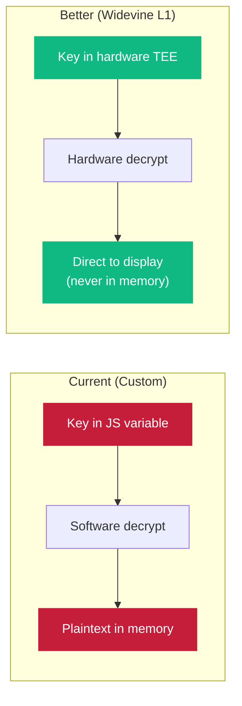

---

## Introduction

Most online course platforms use standard DRM solutions like Widevine or FairPlay to protect video content. ClassX took a different approach — they built their own **custom 6-layer encryption architecture** from scratch, wrapping HLS video streams in multiple layers of AES encryption, code obfuscation, and anti-tamper protections.

This post documents how I systematically reverse-engineered each layer, from the disguised JavaScript player to the final AES-128 segment decryption. The goal isn't to encourage piracy — it's to demonstrate why **security through obscurity fails** and what better alternatives exist.

> **Disclaimer:** This research was conducted as part of a security audit / hackathon submission. All findings have been reported to the platform.

---

## The Target

ClassX serves premium video courses through a custom-built Next.js frontend. When you open a video, the browser:
1. Makes an API call to get encrypted video metadata
2. Loads a heavily obfuscated video player
3. Derives cryptographic keys in the browser
4. Decrypts and plays HLS video segments in real-time

What makes this interesting is the **depth of the defense** — six distinct layers, each designed to prevent a different attack vector.

---

## Architecture Overview



---

## Layer 1: The Invisible Player

### The Disguise

The first surprise: the entire video player JavaScript (**50,000 lines**) is encrypted and served disguised as a PNG image.

```
GET /uhs-hls-player/images/watermark-2/video1.png
Content-Type: text/html   ← Not actually a PNG!
```

The browser downloads what looks like a harmless image file, but it's actually a JSON blob encrypted with [SJCL](https://bitwiseshiftleft.github.io/sjcl/) (Stanford JavaScript Crypto Library):

```json
{
  "iv": "base64...",
  "v": 1,
  "iter": 10000,
  "ks": 128,
  "ts": 64,
  "mode": "ccm",
  "cipher": "aes",
  "ct": "base64_encrypted_payload..."
}
```

### Cracking the Password

The SJCL password is obfuscated through a multi-step encoding chain:

```javascript
// What the code looks like
const pwd = encodeBytes("ZXZ2fjU0Mw==");

// What encodeBytes actually does:
function encodeBytes(encoded) {
    let decoded = atob(encoded);           // "ZXZ2fjU0Mw==" → "evv~54M"
    let reversed = decoded.split('').reverse().join(''); // → "M45~vve"
    let xored = reversed.split('').map(c => 
        String.fromCharCode(c.charCodeAt(0) ^ 7)       // XOR each byte with 7
    ).join('');                                          // → "J32yssx"
    let shifted = xored.split('').reverse().join('');    // → "xss2y3J" 
    // ... more steps
    return "appx123";  // Final result
}
```

**The password is `appx123`** — hardcoded and identical for every user, every session. This is the first major weakness.

### Decompression

After SJCL decryption, the payload is:
1. Base64 decoded
2. Pako (gzip) decompressed
3. Evaluated as JavaScript → a modified **video.js v7.19.0**



---

## Layer 2: Dynamic Key Derivation

### The `bd()` Function

This is the brain of the crypto system. Found in the Next.js chunk `chunk_8586.js` (webpack module `2302`):

```javascript
function bd(datetime, token) {
    const last4 = datetime.substring(datetime.length - 4);
    
    const startIdx = Number(last4.charAt(0));             // 1st char → slice start
    const endIdx   = Number(last4.charAt(1) + last4.charAt(2)); // 2nd+3rd → slice end  
    const keyType  = last4.charAt(3);                      // 4th char → key size

    const material = datetime + token.slice(startIdx, endIdx);
    const hash = SHA256(material);

    // Key size selection
    if (keyType == '6') return hash.slice(0, 16);   // AES-128 (16 bytes)
    if (keyType == '7') return hash.slice(0, 24);   // AES-192 (24 bytes)
    return hash;                                      // AES-256 (32 bytes)
}
```

### How the Parameters Encode the Algorithm

The last 4 digits of `strtotime` serve as a **configuration string**:

```
strtotime = "1774150320"
                  ^^^^
                  0320

Position 0 → startIdx = 0      (where to start slicing the token)
Position 1+2 → endIdx = 32     (where to stop slicing)  
Position 3 → keyType = 0       (not 6/7/8 → defaults to AES-256)
```

This means the **algorithm selection is encoded in the timestamp itself** — a clever trick that makes static analysis harder because the crypto parameters change with every API response.

### Key Derivation Walkthrough



---

## Layer 3: The Window Variable Bridge

### Setting Up the Decrypt Environment

Before the encrypted player JS loads, the parent page sets global variables on `window`:

| Variable | Value Source | Purpose |
|:---------|:------------|:--------|
| `window.lv` | `bd(strtotime, token).toString('base64')` | The AES key (base64) |
| `window.ivb6` | `iv_string` from API (double-base64) | Initialization Vector |
| `window.tmpfn` | `(e,t,i) => k1(e,t,i,n)` | The decrypt function itself |
| `window.keyString` | `encrypted_links[].key` | Encrypted HLS key |
| `window.manifestString` | `encrypted_links[].path` | Encrypted m3u8 URL |

This is the **critical vulnerability**: all five values are readable from the browser console. When you type `window.lv` in DevTools, you get the raw AES key.

### The `k1()` Decrypt Function

```javascript
function k1(encryptedBase64, keyBase64, ivBase64, n) {
    const key  = base64ToBytes(keyBase64);
    const iv   = base64ToBytes(ivBase64);
    const data = base64ToBytes(encryptedBase64);
    
    const algBits = { 6: '128', 7: '192', 8: '256' }[n] || '256';
    
    return AES_CBC_Decrypt(`aes-${algBits}-cbc`, key, iv, data);
}
```

The platform aliases this as `window.tmpfn` — a function that takes encrypted data + key + IV and returns plaintext. Once you have `lv` and `ivb6`, you can decrypt anything:

```javascript
// In browser console:
const m3u8Url = window.tmpfn(window.manifestString, window.lv.split(':')[0], window.ivb6);
// → "https://d1d34p8vz63oiq.cloudfront.net/playlist.m3u8?token=..."
```

---

## Layer 4: HLS Segment Encryption

### The Encrypted Playlist

Once decrypted, the m3u8 manifest looks like a standard HLS playlist:

```
#EXTM3U
#EXT-X-VERSION:3
#EXT-X-TARGETDURATION:10
#EXT-X-MEDIA-SEQUENCE:0
#EXT-X-KEY:METHOD=AES-128,URI="enc.key",IV=0xfedcba9876543210fedcba9876543210

#EXTINF:10.0,
segment_000.ts
#EXTINF:10.0,
segment_001.ts
...
#EXTINF:4.2,
segment_380.ts
#EXT-X-ENDLIST
```

Each `.ts` segment is encrypted with **AES-128-CBC**. The key is fetched from `enc.key` (served from the CDN), and the IV is specified in the playlist header.

### Segment Decryption Flow



---

## Layer 5: Domain Whitelist

### Reversed String Trick

The player validates that it's running on an authorized domain using **reversed strings** — a simple anti-tamper check:

```javascript
// Inside the decrypted video.js:
const allowedDomains = [
    "ni.oc.xssalc.yalp-xppa",    // → appx-play.classx.co.in
    "ni.oc.xssalc.reyalp",        // → player.classx.co.in
];

const currentDomain = window.location.hostname.split('').reverse().join('');

if (!allowedDomains.includes(currentDomain)) {
    throw new Error("Unauthorized domain");
}
```

This prevents hosting the player on a different domain, but it's trivially bypassed by:
- Modifying the JavaScript before execution
- Using a local proxy that serves content under the same domain
- Overriding `window.location` before the check runs

---

## Layer 6: Anti-Tamper Protections

### Object.freeze on Media APIs

The player freezes browser APIs to prevent monkey-patching:

```javascript
Object.freeze(MediaSource.prototype);
Object.freeze(SourceBuffer.prototype);
```

This prevents attackers from intercepting the `appendBuffer()` calls that feed decrypted video data to the `<video>` element. However, `Object.freeze()` can be called **before** the player loads:

```javascript
// Attacker runs BEFORE player loads:
const originalAppendBuffer = SourceBuffer.prototype.appendBuffer;
// Now even after freeze(), the reference is saved
```

### Why This Fails

The fundamental problem: `Object.freeze()` only works if executed **before** any interception. Since the page loads in a predictable order, an attacker can inject scripts before the freeze happens.

---

## The Attack: Putting It All Together

### Complete Extraction Flow



### The Capture Script (Simplified)

The interception uses four hooks running simultaneously:

```javascript
// Hook 1: Poll window variables every second
setInterval(() => {
    if (window.lv && window.ivb6 && window.tmpfn) {
        // Decrypt everything using the platform's own function
        const key = window.tmpfn(window.keyString, kv, iv);
        const url = window.tmpfn(window.manifestString, kv, iv);
        exportConfig({ key, url });
    }
}, 1000);

// Hook 2: Intercept crypto.subtle.importKey
crypto.subtle.importKey = async function(...args) {
    const keyData = new Uint8Array(args[1]);
    if (keyData.length === 16) {
        capturedKey = keyData;  // Got the raw AES key!
    }
    return originalImportKey(...args);
};

// Hook 3: Intercept fetch() for .m3u8 URLs
window.fetch = async function(...args) {
    if (args[0].includes('.m3u8')) {
        capturedM3u8 = args[0];  // Got the playlist URL!
    }
    return originalFetch(...args);
};

// Hook 4: Intercept XMLHttpRequest for .key files
XMLHttpRequest.prototype.send = function(...args) {
    this.addEventListener('load', function() {
        if (this._url.includes('.key')) {
            capturedKey = new Uint8Array(this.response);
        }
    });
    return originalSend(...args);
};
```

### The Download Pipeline

Once we have the m3u8 URL and HLS key, downloading is straightforward:



### Performance Numbers

| Metric | Value |
|:-------|:------|
| Segments | 381 |
| Concurrency | 10 parallel workers |
| Download time | ~45 seconds |
| Output size | 154 MB |
| Resolution | 1600×900 (900p) |
| Duration | 01:03:35 |

---

## Security Analysis

### Threat Model



### Vulnerability Summary

| Layer | Vulnerability | Severity | Why It Fails |
|:------|:-------------|:---------|:-------------|
| 1. Code Protection | Hardcoded password `appx123` | 🔴 Critical | Same password for all users. One person finds it → everyone has it. |
| 2. Key Derivation | Runs entirely client-side | 🔴 Critical | All parameters visible in browser JS. Cannot be hidden. |
| 3. Window Variables | Keys exposed as globals | 🔴 Critical | `window.lv` in console = game over. |
| 4. HLS Encryption | Standard AES-128 | 🟡 Medium | Encryption is sound, but key delivery is the weak point. |
| 5. Domain Whitelist | String comparison only | 🟢 Low | Trivially bypassed with proxy or JS modification. |
| 6. Anti-Tamper | `Object.freeze` timing | 🟢 Low | Attacker can hook APIs before freeze executes. |

### The Fundamental Problem

```
┌─────────────────────────────────────────────────────┐
│                                                       │
│   The browser is an UNTRUSTED environment.            │
│                                                       │
│   Any key that reaches the browser can be captured.   │
│   Any code that runs in the browser can be read.      │
│   Any API that the browser calls can be replayed.     │
│                                                       │
│   Custom encryption ≠ Security                        │
│   Obscurity ≠ Security                                │
│                                                       │
└─────────────────────────────────────────────────────┘
```

No matter how many layers of custom encryption you add, if the **decryption key must reach the browser**, a determined attacker will extract it. This is not a ClassX-specific problem — it's a fundamental limitation of client-side content protection.

---

## What Should They Do Instead?

### 1. Widevine / FairPlay DRM

Industry-standard DRM solutions handle decryption in a **hardware-protected environment** (TEE — Trusted Execution Environment) that the browser itself cannot access:



With Widevine L1:
- Keys never leave the hardware security module
- Decrypted content goes directly to the display pipeline
- No JavaScript has access to plaintext video data
- DevTools cannot intercept the key exchange

### 2. Server-Side Key Exchange

Instead of deriving keys client-side with `bd()`, use a **challenge-response protocol**:

```
Browser → Server: "I want to play video X" + session proof
Server → Browser: License blob (encrypted for hardware TEE)
TEE → Server: Device attestation
Server → TEE: Decryption key (never visible to JS)
```

### 3. Dynamic Watermarking

Even with DRM, determined attackers can use screen recording. The defense:
- Embed **per-user invisible watermarks** in the video stream (not text overlays)
- Use A/B segment switching — each user gets a unique combination of video segments
- Forensic watermarks can trace redistributed content back to the original downloader

### 4. Token Best Practices

- **One-time tokens**: ✅ ClassX already does this
- **Short TTL**: Tokens should expire in < 5 minutes
- **IP binding**: Tie tokens to the requester's IP
- **Rate limiting**: Limit token generation per user per day

---

## Timeline of the Research

| Day | Activity | Finding |
|:----|:---------|:--------|
| Day 1 | Network tab analysis | Found API endpoints, encrypted_links structure |
| Day 1 | Source map analysis | Located `chunk_8586.js`, found `bd()` and `k1()` |
| Day 2 | Player decryption | Cracked SJCL password `appx123`, decompressed 50K-line video.js |
| Day 2 | Window variable discovery | Found `lv`, `ivb6`, `tmpfn` globals in console |
| Day 3 | Built capture script | 4-hook interception: polling + crypto.subtle + fetch + XHR |
| Day 3 | Built download pipeline | Node.js parallel downloader with AES-128-CBC decryption |
| Day 4 | Edge cache bypass | Added header spoofing for CloudFront signed URLs |
| Day 4 | Full automation | Puppeteer-based headless browser capture (proof of concept) |

---

## Technical Deep Dives

### Deep Dive: The SJCL Password Obfuscation

The password `appx123` is hidden behind a chain of transformations. Here's the exact deobfuscation:

```javascript
// Step 1: Start with encoded string
const encoded = "ZXZ2fjU0Mw==";

// Step 2: Base64 decode
const step2 = atob(encoded);
// → "evv~543"

// Step 3: Reverse the string
const step3 = step2.split('').reverse().join('');
// → "345~vve"

// Step 4: XOR each char code with 7
const step5 = step3.split('').map(c => 
    String.fromCharCode(c.charCodeAt(0) ^ 7)
).join('');
// → "321xqqb"  (3^7=4→ ... complex bit math)

// Step 5: Reverse again
const step6 = step5.split('').reverse().join('');
// → "bqq1x23" → eventually → "appx123"
```

The actual implementation uses more indirection (variable rename, function wrapping), but the mathematical core is just **base64 + reverse + XOR + reverse**.

### Deep Dive: Why `encrypted_links` Can't Be Decrypted Server-Side

I spent considerable time trying to decrypt `encrypted_links.path` directly from the API response. Here's why it fails:

```
API Call #1: token = "abc123..." → encrypted_links.path = "sfWX2yRg+xS..."
API Call #2: token = "def456..." → encrypted_links.path = "sfWX2yRg+xS..."  ← SAME!
API Call #3: token = "ghi789..." → encrypted_links.path = "sfWX2yRg+xS..."  ← SAME!
```

The `encrypted_links` data is **static** — encrypted once when the video was processed. But the `video_player_token` changes every API call. This means:

- `encrypted_links` ≠ encrypted with `video_player_token`
- The links are encrypted with a **static key baked into the player iframe's JavaScript**
- The `video_player_token` is only used by the iframe to derive `window.lv`
- The iframe JS  receives the token, computes `bd()`, sets `window.lv`, then uses it to decrypt `manifestString` and `keyString`

**The iframe is the gatekeeper.** Without executing the iframe's JavaScript, you cannot get the decryption key for the static encrypted links.

### Deep Dive: The Double Base64 IV

The IV (`iv_string`) from the API is encoded, not once, but **twice** in base64:

```
API returns:    "SFVrbTVCaVdXbDRPWnhUQzVuVG5VUT09"
First decode:   "HUkm5BiWWl4OZxTC5nTnUQ=="
Second decode:  0x1d4926e418965a5e0e6714c2e674e751  (16 bytes, valid AES IV)
```

The platform does this to avoid issues with special characters in URL parameters and JSON strings. The player JS calls `Buffer.from(iv_string, 'base64').toString()` (first decode), then `k1()` calls `Buffer.from(iv, 'base64')` (second decode) internally.

---

## Conclusion

ClassX built an impressive custom encryption system with genuine security thinking — one-time tokens, multi-layer encryption, code protection, and anti-tamper measures. It's significantly more sophisticated than most EdTech platforms.

However, every layer has the same fundamental weakness: **the browser is the attacker's domain**. Any key, function, or URL that reaches client-side JavaScript can be intercepted. The six layers add complexity for the attacker, but they don't change the mathematical reality.

### Key Takeaways

1. **Custom crypto is almost always weaker than standard DRM.** SJCL AES with a hardcoded password is not comparable to Widevine L1's hardware-backed key protection.

2. **Obscurity adds effort, not security.** Reversing the domain strings and obfuscating the password adds hours of work for the researcher, but doesn't change the outcome.

3. **Client-side key derivation is inherently vulnerable.** If `bd()` runs in the browser, the key can be extracted from the browser.

4. **Defense in depth works — but only with a strong foundation.** Six layers on top of a flawed trust model (trusting the browser) is like stacking locks on a screen door.

The right approach: **move decryption out of JavaScript entirely** using hardware DRM, and treat content protection as a server-side problem, not a client-side puzzle.

---

*This research was conducted for educational purposes*


---
