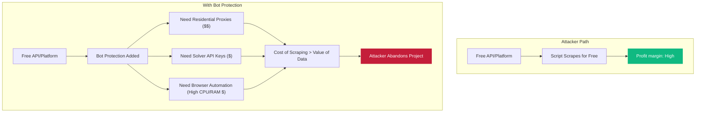
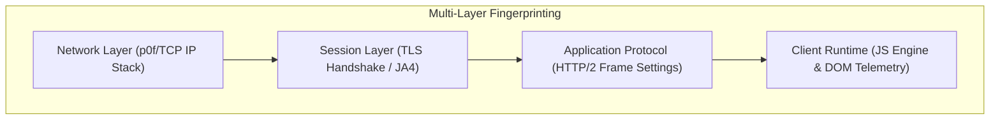
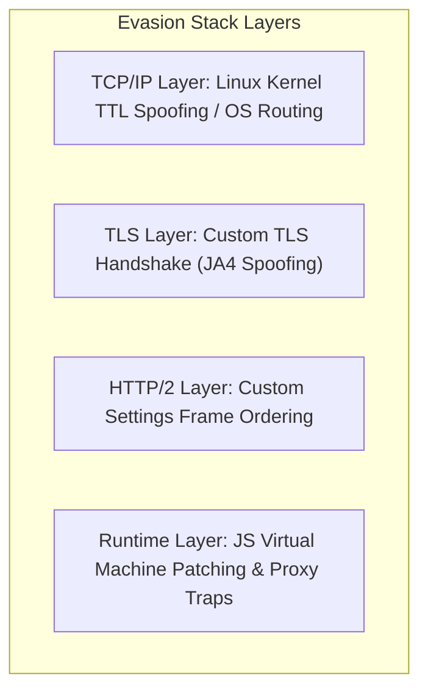

## Introduction

If you look at the raw request logs of any major web platform today, you'll see a quiet, ongoing war. According to recent research from Imperva's annual Bad Bot Reports, automated bot traffic has officially surpassed human traffic, accounting for **51% to 58% of all internet activity**. The web is now a machine-majority landscape.

To defend their infrastructure, prevent ad revenue fraud, stop unlimited account creation, and protect free tiers of their APIs, modern platforms implement complex Web Application Firewall (WAF) services and anti-bot systems like Cloudflare Turnstile, Akamai Bot Manager, hCaptcha, and PerimeterX.

In this deep dive, we'll look at how these bot protections work, how modern automation bypasses them, and why bot defense isn't a problem of making an "unbreakable" puzzle — but a game of economics.

---

## Operational Cost Invalidation

A common misconception is that CAPTCHAs (Completely Automated Public Turing test to tell Computers and Humans Apart) are designed to be unsolvable by machines. In the age of advanced machine learning and computer vision, no visual puzzle is truly machine-proof. In fact, modern AI models can solve standard Google reCAPTCHA v2 image grids with higher accuracy and speed than the average human.

So why do we still use them? The answer is **Operational Cost Invalidation**.



For an attacker, a scraping or automation task is a business calculation:

$$\text{Net Profit} = \text{Value of Data/Action} - \text{Cost of Infrastructure}$$

When a platform is unprotected, the cost of infrastructure is near zero: a lightweight Python script making thousands of `HTTP GET` requests per second using standard library `urllib` or `requests`.

When bot protections are introduced, the attacker is forced to:
1. **Use headful browsers** (Puppeteer, Playwright) instead of lightweight HTTP clients. This increases CPU and memory overhead per request by **10x to 50x**.
2. **Buy residential proxy pools** to bypass IP-based rate limits. High-quality residential bandwidth is expensive (often costing $2 to $15 per GB).
3. **Use CAPTCHA solving APIs** (like 2Captcha or Capsolver), which charge per solve.

By raising the cost of the attack, the platform makes the automation financially unviable. The bot protections don't have to be perfect; they just have to make the attack **more expensive** than the value of the target resource.

---

## Multi-Layer Fingerprinting

Modern anti-bot systems don't just rely on interactive puzzles. They collect hundreds of signals across multiple layers of the networking stack to distinguish between a real human browsing from a consumer laptop and an automated script.



### Client-Side Runtime & DOM Telemetry
When you load a page protected by a modern WAF, a challenge script runs in the background. It queries the browser environment for a wide array of properties, including:
- **Canvas & WebGL Rendering:** The script instructs the browser to render a hidden 2D/3D image. Because of slight differences in graphics drivers, GPU chipsets, and browser rendering engines, the resulting image hash is highly unique.
- **Audio Context Fingerprinting:** The browser is asked to generate a sine wave and synthesize audio. The output waveform varies based on the operating system and audio driver stack.
- **System Fonts & Screen Properties:** The exact list of installed system fonts, screen resolution, viewport size, and color depth are collected.
- **Navigator and Window Objects:** Checking for properties like `navigator.hardwareConcurrency`, `navigator.deviceMemory`, and language settings to ensure they match the claimed User-Agent.

### TLS Fingerprinting via JA3 / JA4
Even if an attacker spoofs their User-Agent header to look like Chrome on macOS, their networking library might betray them. During the SSL/TLS handshake, the client sends a `Client Hello` message containing supported cipher suites, extensions, elliptic curves, and point formats.

Anti-bot systems hash these parameters to create a fingerprint (traditionally using the **JA3** standard, and more recently **JA4**).

$$\text{JA4} = \text{a(protocol/options)} \_ \text{b(ciphers hash)} \_ \text{c(extensions hash)}$$

```
Python Requests JA3:  771,4865-4866-4867-49195-49199-49196...,65281-0-23-13...,29-23-24,0
Chrome Browser JA3:   771,4865-4866-4867-52392-52393...,0-23-65281-10...,29-23-24-25,0
```

If the User-Agent claims to be Chrome, but the JA4 signature matches Python's `urllib3` or Go's standard `http` library, the WAF flags the request as a bot immediately — blocking it before the application server even receives it.

### HTTP/2 Settings Frame Fingerprinting
Modern web scrapers making raw HTTP/2 requests are caught by settings frames. In HTTP/2, client connections initiate with a `SETTINGS` frame that defines parameters like:
- `SETTINGS_HEADER_TABLE_SIZE`
- `SETTINGS_ENABLE_PUSH`
- `SETTINGS_MAX_CONCURRENT_STREAMS`
- `SETTINGS_INITIAL_WINDOW_SIZE`
- `SETTINGS_MAX_FRAME_SIZE`
- `SETTINGS_MAX_HEADER_LIST_SIZE`

Every browser version has a specific order and value set for these parameters. Standard HTTP client libraries use default values that differ drastically from what Chrome or Safari send, creating a high-fidelity fingerprint signal.

### TCP/IP Stack Fingerprinting with p0f
Passive OS Fingerprinting (p0f) operates at the TCP layer. WAFs inspect the initial TCP packet (`SYN` and `SYN-ACK`) parameters:
- **Initial TTL:** Linux kernels default to 64, while Windows hosts default to 128.
- **Window Size:** The initial buffer size.
- **TCP Options:** The presence and order of Options (e.g., MSS, Window Scale, SACK Permitted, NOP, Timestamps).

If a scraper modifies its HTTP headers to masquerade as Chrome on Windows, but the TCP packet shows a TTL of 64 and Linux-style TCP options, the WAF detects the mismatch and rejects the connection.

---

## The Evasion Stack

To bypass these checks, developers must construct complex, low-level evasion stacks that address every layer of the detection system.



### Spoofing TLS and HTTP/2 Fingerprints
To successfully request data without running a full browser, developers use custom HTTP clients compiled with low-level networking stacks (like Go's `tls-client` or C-based `curl-impersonate`). These libraries:
- Intercept the TLS handshake generation, reordering cipher suites and extensions to match Chrome exactly.
- Spoof ALPN (Application-Layer Protocol Negotiation) strings and custom greasing mechanisms.
- Manually construct the HTTP/2 settings frame and connection preface to align with expected desktop browser values.

### Hiding Puppeteer and Playwright from the JS Runtime
When running full browser automation, the goal changes from simulating network frames to hiding the automation harness from the JavaScript environment. Standard ChromeDriver/Puppeteer leaks several flags that WAFs check:

**The `navigator.webdriver` Property**

```javascript
if (navigator.webdriver === true) {
    // Flagged as bot!
}
```

Simply setting `navigator.webdriver = false` is insufficient because WAFs check if the property is configurable or writable:

```javascript
const descriptor = Object.getOwnPropertyDescriptor(navigator, 'webdriver');
if (descriptor.configurable || descriptor.writable) {
    // Flagged! Property was modified using Object.defineProperty
}
```

Patched engines like `rebrowser-puppeteer-core` modify the browser's source code at compile time or hook directly into the V8 debugger protocol to ensure the property is native and unmodifiable.

**Proxy Traps on Native Functions**

Obfuscated anti-bot scripts verify if native methods (like `Function.prototype.toString` or `document.querySelector`) have been hooked or proxied. If an attacker overrides a native function:

```javascript
const original = document.createElement;
document.createElement = function(tag) {
    return original.apply(this, arguments);
};
```

The WAF script checks:

```javascript
if (document.createElement.toString() !== "function createElement() { [native code] }") {
    // Caught! Native code has been modified.
}
```

To bypass this, developers create complex proxy traps using ES6 `Proxy` objects that override both execution behavior and standard metadata calls (`.toString()`, `.constructor`, and prototype inheritances).

**Behavioral Simulation with ghost-cursor**

To satisfy behavioral telemetry engines that analyze mouse paths, automation setups use B-spline paths to simulate real human mouse movements — organic curves with acceleration, deceleration, tremors, and overshoots:

```javascript
import { createCursor } from "ghost-cursor";

const cursor = createCursor(page);
await cursor.click("#turnstile-checkbox-element");
```

---

## Physical Device Farms

When security configurations are set to the highest level, making software bypasses too expensive or fragile, operations shift to physical hardware.

In "click farms" or automated device pools, operations utilize physical racks of mobile devices (typically older, cheap Android smartphones) managed via automated bridges like ADB (Android Debug Bridge).

```
[ WAF Detection Engine ]
      ▲
      │ (Perfect hardware fingerprints, real battery levels, genuine sensors)
[ Physical Rack of Android Devices ]
      ▲
      │ (Commands sent via ADB - Android Debug Bridge)
[ Control Script ]
```

These setups bypass anti-bot mechanisms completely because:
1. **Real Hardware:** The device is a genuine physical phone. Canvas, audio, and WebGL fingerprints are perfectly unique and match a consumer hardware profile.
2. **Real Mobile IPs:** The phones connect to local cellular networks (4G/5G) using physical SIM cards, giving them the highest possible IP reputation score.
3. **No Emulation:** The browser is standard mobile Google Chrome on Android — no Puppeteer flags, chromedriver hooks, or node leaks.

While extremely difficult to block, this method represents the absolute limit of the cost scale. The attacker must pay for physical space, hardware cooling, mobile data plans, and device maintenance — rendering low-value scraping campaigns completely unprofitable.

---

## Case Study: Meta's Follower Purges

Every few years, the internet witnesses a sudden event: major Instagram celebrities and brands wake up to see their follower counts drop by hundreds of thousands, or even millions. These sudden drops are the result of platform-wide **bot purges** executed by Meta to clean up its social graphs.

### Why Bots Follow High-Profile Accounts
For bot operators, following top-tier accounts (like Cristiano Ronaldo, Selena Gomez, or Kylie Jenner) is a strategy for evasion:
- **Masking Behavior:** A bot account that only follows niche, low-reputation targets stands out. Mixing in follows to major public figures mimics a normal human user's onboarding behavior.
- **Inflating Follower Counts:** Many automated accounts are sold as "fake followers" to smaller creators looking to artificially boost their social proof.

### Meta's Detection Pipeline
Because Meta handles billions of active users, manual auditing is impossible. Instead, Meta uses a multi-layered detection pipeline:

1. **Deep Entity Classification (DEC):** Meta's primary ML system analyzes the "social graph" — the network of connections, interaction frequencies, and temporal behavior patterns — rather than evaluating accounts in isolation.
2. **Behavioral Heuristics:** The system flags accounts with unnatural, mechanical action frequencies (e.g., following hundreds of users in minutes, leaving repetitive emojis, or performing interactions at a precise cadence).
3. **Account Metadata Anomalies:** Suspicious email domains, phone verification patterns, high-entropy usernames, and lack of profile completion (missing bio, profile image, or posts) raise the risk score.
4. **Coordinated Inauthentic Behavior (CIB):** Graph models flag clusters of accounts acting in tandem. If 10,000 accounts are created within the same hour, share similar device specs, or follow the same set of creators from residential proxies, the entire cluster is flagged.

When Meta runs batch-processing sweeps on these flagged entities, millions of accounts are disabled simultaneously. For high-profile accounts, a significant percentage of their passive followers are bots — resulting in sudden, dramatic drops in follower counts. While frustrating for creators, these purges are essential to maintain metric integrity for advertisers and brands.

---

## A Defensive Cheat Sheet

If you're a developer looking to protect your platform from automated abuse, here's a progressive strategy:

**Shift challenging to the edge.** Never let unverified traffic reach your application backend. Use an edge WAF (like Cloudflare or AWS WAF) to intercept requests, stopping CPU-heavy JS validation from consuming your server's resources.

**Implement JA3/JA4 TLS validation.** Validate the TLS fingerprint of incoming requests. If the User-Agent claims a major desktop browser but the TLS handshake matches a scraper framework, drop the connection immediately at the edge.

**Set strict ASN and country blocking.** Block or challenge requests originating from hosting providers and data centers (AWS, DigitalOcean, Hetzner, OVH) unless you're explicitly building a server-to-server API. Real users don't browse websites from AWS IP addresses.

**Deploy honeypot elements.** Place hidden links or input fields in your HTML styled with `display: none` or positioned off-screen. Real users will never interact with them. If a cursor clicks on them or a form script submits values to them, flag the session immediately.

**Keep the free tier protected.** Bots naturally choose the path of least resistance: scraping the free web UI rather than paying for the API. By placing robust CAPTCHAs (like Cloudflare Turnstile) on the web dashboard, you protect your business model and push legitimate clients toward the paid developer portal.

---

*This article is written for educational and defensive development purposes. Understanding the tactics of browser evasion is the first step in building resilient, production-grade security architectures.*